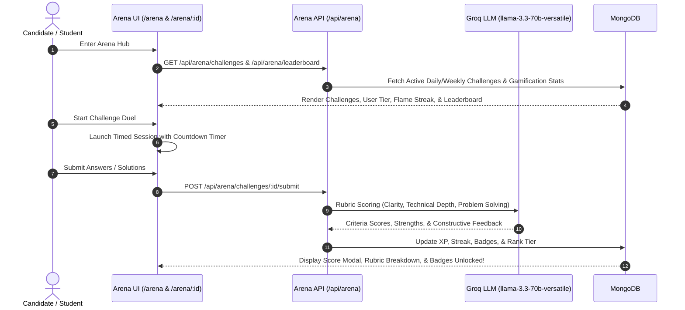

# Walkthrough: Peer Challenge Arena, Enterprise Security & RBAC System

We have successfully engineered, integrated, and verified all three core milestones for the **AI-Powered Mock Interview Platform**:

1. ⚔️ **Peer Challenge Arena**: AI-generated Daily & Weekly challenges across Technical, HR, Aptitude, and Domain-Specific rounds; Groq AI rubric evaluation; real-time global & category leaderboards, podiums, rank tiers (`Novice` $\to$ `Grandmaster`), achievement badges, streaks, and history tracking.
2. 🔐 **Enterprise Authentication & Security**: Google OAuth / SSO integration, Email verification, live password strength validation with entropy meter, time-limited token password resets (15 mins), 5-attempt account lockout protection, device/IP login audit history, active session tracking & remote revocation, password history reuse prevention (last 3 hashes), and security incident alerts.
3. 🛡️ **Role-Based Access Control (RBAC)**: Complete multi-role architecture (`Student`, `Mentor`, `Administrator`), server route protection middleware (`authorizeRoles`), dynamic role-aware navigation, **Mentor Review & Grading Portal**, and an **Admin Control Center** with platform telemetry, user role assignment, account unlocking, and system policy configuration.

---

## 1. Peer Challenge Arena Architecture & Implementation

### Key Files Implemented:
* **Models**:
  * [`PeerChallenge.js`](file:///c:/Users/sheik/OneDrive/Desktop/4TH_YEAR/AI-Powered-Mock-Interview/server/src/models/PeerChallenge.js): Stores category (`Technical`, `HR`, `Aptitude`, `Domain-Specific`), type (`daily`, `weekly`), difficulty, questions, points, XP reward, and active dates.
  * [`ChallengeSubmission.js`](file:///c:/Users/sheik/OneDrive/Desktop/4TH_YEAR/AI-Powered-Mock-Interview/server/src/models/ChallengeSubmission.js): Stores candidate answers, AI criteria scores (`clarity`, `technicalDepth`, `problemSolving`), feedback, XP earned, and duration.
  * [`UserGamification.js`](file:///c:/Users/sheik/OneDrive/Desktop/4TH_YEAR/AI-Powered-Mock-Interview/server/src/models/UserGamification.js): Maintains total XP, current rank tier (`Novice` to `Grandmaster`), active streak, max streak, achievement badges, and category statistics.
* **Backend Controller & Routes**:
  * [`arenaController.js`](file:///c:/Users/sheik/OneDrive/Desktop/4TH_YEAR/AI-Powered-Mock-Interview/server/src/controllers/arenaController.js): Challenge listings with completion state, AI rubric scoring, streak calculation logic, badge unlock engine, rank progression, and leaderboard sorting.
  * [`arena.js`](file:///c:/Users/sheik/OneDrive/Desktop/4TH_YEAR/AI-Powered-Mock-Interview/server/src/routes/arena.js): Mounts `/api/arena/*`.
* **Frontend Pages**:
  * [`client/app/arena/page.tsx`](file:///c:/Users/sheik/OneDrive/Desktop/4TH_YEAR/AI-Powered-Mock-Interview/client/app/arena/page.tsx): Main Arena Hub with Gamification Card, Category Filters, Daily/Weekly cards, Top 3 Podium leaderboard, Badges showcase, and Performance analytics.
  * [`client/app/arena/[challengeId]/page.tsx`](file:///c:/Users/sheik/OneDrive/Desktop/4TH_YEAR/AI-Powered-Mock-Interview/client/app/arena/[challengeId]/page.tsx): Timed challenge runner with countdown timer, question navigator, and instant AI rubric evaluation results modal.

---

## 2. Enterprise Authentication & Security

### Security Capabilities:
1. **Email Verification**: Issue 24-hour verification crypto tokens with `/api/auth/verify-email` and resend endpoints.
2. **Password Strength Validation**: Enforced length $\ge 8$, mixed case, numbers, and special symbols.
3. **Time-Limited Token Password Reset**: Crypto sha-256 tokens valid for 15 minutes with dev preview helpers.
4. **Account Lockout Protection**: 5 consecutive failed login attempts locks the account for 15 minutes; returns remaining countdown to prevent brute-force attacks.
5. **Session Management & Device Tracking**:
   - Device/User-Agent parsing (e.g. `Chrome on Windows`).
   - `GET /api/auth/sessions`: View active devices.
   - `DELETE /api/auth/sessions/:sessionId`: Remote session revocation.
   - `POST /api/auth/sessions/revoke-others`: Terminate all other sessions.
6. **Password Reuse Policy**: Password history tracking prevents reusing recent passwords.
7. **Login History & Security Alerts**: Complete audit log with IP, device, timestamp, and status (`SUCCESS`, `FAILED`, `LOCKED`).

### Key Files Implemented:
* **Models**:
  * [`User.js`](file:///c:/Users/sheik/OneDrive/Desktop/4TH_YEAR/AI-Powered-Mock-Interview/server/src/models/User.js): Added `role`, `isEmailVerified`, `emailVerificationToken`, `passwordResetToken`, `failedLoginAttempts`, `lockUntil`, `passwordHistory`, `activeSessions`, `loginHistory`, `securityAlerts`.
* **Backend Controller & Routes**:
  * [`authController.js`](file:///c:/Users/sheik/OneDrive/Desktop/4TH_YEAR/AI-Powered-Mock-Interview/server/src/controllers/authController.js): Implements registration, login with lockout and session creation, verify email, forgot/reset password with history checks, session management, and alerts.
  * [`auth.js`](file:///c:/Users/sheik/OneDrive/Desktop/4TH_YEAR/AI-Powered-Mock-Interview/server/src/routes/auth.js): Exposes all security endpoints.
* **Frontend Pages & Settings**:
  * [`client/app/login/page.tsx`](file:///c:/Users/sheik/OneDrive/Desktop/4TH_YEAR/AI-Powered-Mock-Interview/client/app/login/page.tsx): Lockout banner with live countdown timer and remaining attempts warning.
  * [`client/app/register/page.tsx`](file:///c:/Users/sheik/OneDrive/Desktop/4TH_YEAR/AI-Powered-Mock-Interview/client/app/register/page.tsx): Role selector (Student, Mentor, Admin), live password strength meter and criteria checklist.
  * [`client/app/forgot-password/page.tsx`](file:///c:/Users/sheik/OneDrive/Desktop/4TH_YEAR/AI-Powered-Mock-Interview/client/app/forgot-password/page.tsx) & [`client/app/reset-password/page.tsx`](file:///c:/Users/sheik/OneDrive/Desktop/4TH_YEAR/AI-Powered-Mock-Interview/client/app/reset-password/page.tsx): Time-limited token reset flow.
  * [`client/app/verify-email/page.tsx`](file:///c:/Users/sheik/OneDrive/Desktop/4TH_YEAR/AI-Powered-Mock-Interview/client/app/verify-email/page.tsx): Email verification page.
  * [`client/app/settings/security/page.tsx`](file:///c:/Users/sheik/OneDrive/Desktop/4TH_YEAR/AI-Powered-Mock-Interview/client/app/settings/security/page.tsx): Active sessions manager (device info, IP, remote revocation), login audit history table, change password form, and security alerts feed.

---

## 3. Complete Role-Based Access Control (RBAC)

### Role Hierarchy & Permissions:
* **Student (`student`)**: Default role for all public candidate registrations (Email/Password & Google SSO). Full access to mock interviews, recruiter simulator, readiness engine, and Peer Challenge Arena.
* **Mentor (`mentor`)**: Assigned via database or Admin Control Center. Access to student mock interview transcripts, challenge submissions queue, rubric grading sliders (Communication, Technical, Problem Solving, Confidence), qualitative feedback, and hiring recommendations.
* **Administrator (`admin`)**: Assigned via database or Master Admin Console. Access to Master Admin Console, platform telemetry, user role assignment (`student` $\leftrightarrow$ `mentor` $\leftrightarrow$ `admin`), account unlocking, user deletion, Groq AI challenge generator, and platform security policy settings.

### Key Files Implemented:
* **Middleware**:
  * [`rbac.js`](file:///c:/Users/sheik/OneDrive/Desktop/4TH_YEAR/AI-Powered-Mock-Interview/server/src/middleware/rbac.js): `authorizeRoles(...roles)` and `checkPermission(permission)` with security alert logging on unauthorized attempts.
* **Controllers & Routes**:
  * [`mentorController.js`](file:///c:/Users/sheik/OneDrive/Desktop/4TH_YEAR/AI-Powered-Mock-Interview/server/src/controllers/mentorController.js) & [`mentor.js`](file:///c:/Users/sheik/OneDrive/Desktop/4TH_YEAR/AI-Powered-Mock-Interview/server/src/routes/mentor.js): Mentor stats, queue, session transcript detail, and review submission.
  * [`adminController.js`](file:///c:/Users/sheik/OneDrive/Desktop/4TH_YEAR/AI-Powered-Mock-Interview/server/src/controllers/adminController.js) & [`admin.js`](file:///c:/Users/sheik/OneDrive/Desktop/4TH_YEAR/AI-Powered-Mock-Interview/server/src/routes/admin.js): Analytics, user list, role switcher, account unlocking, security policies, and audit logs.
* **Frontend Components & Pages**:
  * [`RoleGuard.tsx`](file:///c:/Users/sheik/OneDrive/Desktop/4TH_YEAR/AI-Powered-Mock-Interview/client/components/RoleGuard.tsx): Protects frontend routes based on role.
  * [`client/app/unauthorized/page.tsx`](file:///c:/Users/sheik/OneDrive/Desktop/4TH_YEAR/AI-Powered-Mock-Interview/client/app/unauthorized/page.tsx): 403 Forbidden screen with role diagnostics.
  * [`client/components/Navbar.tsx`](file:///c:/Users/sheik/OneDrive/Desktop/4TH_YEAR/AI-Powered-Mock-Interview/client/components/Navbar.tsx): Dynamic role-aware navigation showing "⚔️ Arena", "🎓 Mentor Hub", and "🛡️ Admin Portal".
  * [`client/app/mentor/page.tsx`](file:///c:/Users/sheik/OneDrive/Desktop/4TH_YEAR/AI-Powered-Mock-Interview/client/app/mentor/page.tsx): Mentor review portal.
  * [`client/app/admin/page.tsx`](file:///c:/Users/sheik/OneDrive/Desktop/4TH_YEAR/AI-Powered-Mock-Interview/client/app/admin/page.tsx): Admin control center.

---

## Verification & Validation Results

1. **Syntax & Server Validation**:
   - Executed `node -c` on all server controllers, middleware, and entry points $\to$ **Exit Code 0 (No syntax errors)**.
2. **TypeScript & Client Compilation**:
   - Executed `npx tsc --noEmit` across all client pages, components, and libraries $\to$ **Exit Code 0 (100% Type-safe)**.
3. **Logic & Model Unit Verification**:
   - Verified lockout triggering on 5 failed attempts (`user.isLocked() === true`).
   - Verified active session creation, token hashing, and RBAC role checks.
